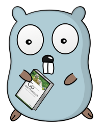

# Codebeispiele zum Go Praxisbuch

Alle wichtigen Codebeispiele aus [Go - Das Praxisbuch](https://www.dpunkt.de/buecher/13398/9783864907135-go-%E2%80%93-das-praxisbuch.html). Alle kleineren ausführbaren Beispiele sind auch direkt zum [Go Playground](https://play.golang.org/) verlinkt und können dort direkt ausgeführt werden. Bei den Projekten gibt es für jeden größeren Zwischenschritt einzelne Verzeichnisse. Die Nummerierung der Überschrifften folgt den Kapiteln im Buch. Deshalb gibt es vereinzelt auch Lücken.

## 2 Vorstellung der Syntax

Verzeichnis: 02_vorstellung_der_syntax

* 02 Variablen
    * [01 Deklaration](https://play.golang.org/p/hzo7dE0NY8M)
* 03 Konstanten
    * [01 Deklaration](https://play.golang.org/p/6MsHvHkTL1e)
    * [02 Untypisiert](https://play.golang.org/p/hCT2bs6cMwk)
    * [03 Typisiert](https://play.golang.org/p/ENOIg1ARjEo)
    * [04 Iota](https://play.golang.org/p/ANpWTiSlR9p)
* 04 Pointer
    * [01 Funktionsweise](https://play.golang.org/p/4BBJDVrPY_X)
    * [02 Funktion erzeugt Pointer](https://play.golang.org/p/ERJqYeEgitf)
* 05 Eigene Typen
    * [01 Meter und Zentimeter](https://play.golang.org/p/oAT_jhzsAII)
* 06 Typumwandlung
    * [01 Äpfel Plus Birnen](https://play.golang.org/p/8FZxSw7oM5v)
    * [02 Anzahl Obst](https://play.golang.org/p/z2EXuIaszsi)
* 07 Zusammengesetzte Strukturen
    * [01 Definition und Deklaration](https://play.golang.org/p/DdRHXQVjEkj)
* 08 Funktionen
    * [01 Einfache Funktion](https://play.golang.org/p/f9KgBBaHXO9)
    * [02 Zwei Rückgabewerte](https://play.golang.org/p/0FsIqQGuHGj)
    * [03 Benannte Rückgabe](https://play.golang.org/p/XZDZX9vdE7P)
    * [04 Naked Return](https://play.golang.org/p/7VgbbPFJZLY)
    * [05 Explizietes Return](https://play.golang.org/p/k_CnqBERSlv)
    * [06 Variadische Funktion](https://play.golang.org/p/3tEGpuGlUpG)
    * [07 First Class Citizen](https://play.golang.org/p/GubzYeF0mHJ)
    * [08 Closures](https://play.golang.org/p/5eyQklNn7ug)
    * [09 Defer 1](https://play.golang.org/p/6JZsB8V_BEn)
    * [10 Defer 2](https://play.golang.org/p/x2d1OFs-U3U)
    * [11 Defer 3](https://play.golang.org/p/jfucn5zmzIR)
* 09 Objektorientierung mit Methode
    * [01 Rechteck](https://play.golang.org/p/yzSEp0J30ox)
* 12 Slices
    * [01 append 1](https://play.golang.org/p/90w-M9Cu2g2)
    * [02 append 2](https://play.golang.org/p/TIkdNw6Z_Pq)
    * [03 composite literal](https://play.golang.org/p/Z_SPnJK04hI)
    * [04 range](https://play.golang.org/p/9xF9JfgOiM7)
    * [05 slice a slice](https://play.golang.org/p/ubprLZ4cVrM)
    * [06 Speicherallokation durch append](https://play.golang.org/p/S8DdXdHTVMQ)
    * [07 Verwenden von Copy](https://play.golang.org/p/lyw4L0hxpY0)
    * [08 Copy 2](https://play.golang.org/p/fj6rIZfkaLs)
* 13 Das Slice als Pointer
    * [01 intCopy 1](https://play.golang.org/p/tO6yHevPV9O)
    * [02 intCopy 2](https://play.golang.org/p/ImpQau2WgV_5)
* 14 Maps
    * [01 Verwendung einer nil-Map](https://play.golang.org/p/Lhv5LMKsCvN)
    * [02 Erzeugen einer leeren Map mit make()](https://play.golang.org/p/mScJBUgHRze)
    * [03 make in Verbindung mit der Kurzdeklaration](https://play.golang.org/p/Pe_7lCTKFCE)
    * [04 Erzeugen einer Map mit einem Composite Literal](https://play.golang.org/p/Qu1-ReXpgEP)
* 15 `if`
    * [01 if Abfrage](https://play.golang.org/p/Ns96QhdWVlB)
* 16 `switch`
    * [01 Ausdruck nach `switch`](https://play.golang.org/p/xk4fccIau8Z)
    * [02 `switch` mit Deklaration](https://play.golang.org/p/dpvxssiE0RQ)
    * [03 Ausdruck bei `case`](https://play.golang.org/p/PvUEphpkUPJ)
    * [04 `fallthrough`](https://play.golang.org/p/SN_tWI1zyET)
* 17 `for`
    * [01 `for` mit Zähler](https://play.golang.org/p/bGjLW5mssr3)
    * [02 `for` mit Bedingung](https://play.golang.org/p/SyJCtJOosA-)
    * [03 `for` ohne Bedingung](https://play.golang.org/p/goxKD33zbMN)
    * [04 `continue`](https://play.golang.org/p/g8oxCWmnu44)
* 18 Labels und `goto`
    * [01 Definition](https://play.golang.org/p/ohK3pQwoRAf)
    * [02 `goto` überspringt Deklaration](https://play.golang.org/p/_tk2mjkeazE)
    * [03 label mit continue](https://play.golang.org/p/yiIgexQJjt9)
* 20 UTF8 und Runes
    * [01 utf8](https://play.golang.org/p/6QF9xFq2pCy)

## 3 Projekt: Command Line Interface

Verzeichnis: 03_projekt_cli

Innerhalb dieses Projektes gibt es keine Links zum Playground. 

* 01 gocat
* 02 gomd5
* 03 gomd5 mit flags

## 5 Projekt: Ein einfacher Webloader

Verzeichnis: 05_projekt_gourl

Innerhalb dieses Projektes gibt es keine Links zum Playground.

* 01 Grundgerüst
* 02 Ohne Flag Unterstützung
* 03 gourl mit Output
* 04 Ausgabe Header
* 05 URL Gültigkeit

## 7 Projekt: Code generieren

Verzeichnis: 07_projekt_gogen

* 01 Beispiel Stack
* 02 gogen
* 03 Template
* 04 go generate

## 8 Concurrency-Grundlagen

Verzeichnis: 08_concurrency_grundlagen

* 03 Goroutinen
    * [01 Goroutine mit WaitGroup](https://play.golang.org/p/lYM-iaxKjLp)
    * [02 Goroutine über anonyme Funktion](https://play.golang.org/p/NguvPUBkeO-)
* 04 Channels
    * [03 Sender und Empfänger](https://play.golang.org/p/HbbYa0ePUun)
    * [04 Channel verwenden](https://play.golang.org/p/Hz0yoABgbqx)
    * [05 Channels als In- und Output](https://play.golang.org/p/XJ_i4Bod7rg)
    * [06 In Puffer schreiben](https://play.golang.org/p/cDVc0-23BEU)
    * [07 Aus Puffer lesen](https://play.golang.org/p/1SqQdVZxYBe)
    * [08 Sender und Empfänger mit einem Buffered Channel](https://play.golang.org/p/EXt0NslCaCg)
    * [09 gerichteter Channel](https://play.golang.org/p/7wk9vXVpYK3)
* 05 Einen Channel schließen
    * [10 Der vergessene Zuhörer](https://play.golang.org/p/zIlhlkNJS6-)
    * [11 Der benachrichtigte Zuhörer](https://play.golang.org/p/VFVqMTKZpEv)
    * [12 Auswertung gesendeter Wert](https://play.golang.org/p/hGDqP_syYvU)
    * [13 Verwendung von close()](https://play.golang.org/p/QZ7HE08Z10z)
    * [14 range über Channel](https://play.golang.org/p/eEYSTahj2sU)
* 06 Select
    * [01 Ein kleines Ping-Pong-Programm](https://play.golang.org/p/8NIKW5WM36h)
    * [02 Ausführen von Funktionen in einer case-Anweisung](https://play.golang.org/p/3i6Q6a9scey)
* 07 Race Conditions und Data Races
    * [01 Data Race 1](https://play.golang.org/p/4dAMVaOk10h)
    * [02 Data Race 2](https://play.golang.org/p/x9AjsDeysix) 
    * [03 Mutex](https://play.golang.org/p/kdIX2WLtbYc)  
    * [04 Atomic](https://play.golang.org/p/-pZJt8An7uw) 

## 9 Concurrency Patterns

Verzeichnis: 09_concurrency_patterns

* 02 Goroutinen melden, wenn sie fertig sind
    * [01 Ergebnis an einen Channel](https://play.golang.org/p/YFKSGEVCztU)
    * [02 Verwendung des sync.WaitGroup](https://play.golang.org/p/eiOIh9jC8nT)
    * [03 done-Channel](https://play.golang.org/p/LHFrAdlCcJD)
    * [04 buffered done-Channel](https://play.golang.org/p/ElaXZF5TKia)
* 03 Beenden von Goroutinen
    * [01 Timeout](https://play.golang.org/p/Te--yzkdGUn)
* 04 Context
    * [01 Beispiel mit Generator](https://play.golang.org/p/1UaTie24lDN)
* 05 Prüfung eines geschlossenen Channels
    * [01 Code blockiert](https://play.golang.org/p/UECsGvOXoDQ)
    * [02 Prüfen mit select](https://play.golang.org/p/fol7-PSerpj)
* 06 Pipelines
    * [01 Channel als Rückgabewert](https://play.golang.org/p/jV8YsVYafEk)
    * [02 Output-Channel als Input](https://play.golang.org/p/Zw10MHFhAZI)
* 07 Generator
    * [01 Generator-Funktion](https://play.golang.org/p/RYZ_Iwouzho)
    * [02 Generator mit done-Channel](https://play.golang.org/p/cJjOzuL48xM)
* 08 Fan-In und Fan-Out
    * [01 Fan-Out](https://play.golang.org/p/ZD5_mKTwvc1)
    * [02 Fan-In](https://play.golang.org/p/xlGfXnNjpFi)
* 09 Channel of Channels
    * [01 Channel of Channels](https://play.golang.org/p/NcqinARqBOW)
    * [02 Verteilung von Tasks](https://play.golang.org/p/SLYylQJBVVK)
* 10 Worker Pool
    * [01 Beispiel komplett](https://play.golang.org/p/klZNeNEtIsS)

## 10 Projekt: Go Concurrency

* 01 goconc (Kapitel 10.3)
* 02 goconc (Kapitel 10.4)
* 03 goconc (Kapitel 10.5)
* 04 goconc (Kapitel 10.6)

## 11 Testen und Benchmarks 

* 01 Tests 
* 02 Subtests 
* 03 Tabellarische Tests
* 04 Testen mit Beispielen
* 05 Benchmarks
* 06 Subbenchmarks

## 12 Projekt: Image Resizer

* 01_imgres (bis Kapitel 12.6)
* 02_imgres (bis Kapitel 12.8)
* 03_imgres (Kapitel 12.9)

## Gopher Abbildungen

Alle Gopher Abbildungen wurden von Andreas Schröpfer erstellt und dürfen nur mit schriftlichen Einverständnis weiter verwendet werden. 

Der Gopher ist das Maskottchen der Sprache Go und wurde durch Renee French entworfen. Weitere Informationen finden sich im [Go Blog](https://blog.golang.org/gopher).